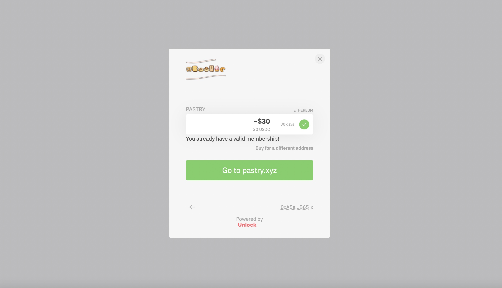

# GETTING STARTED

## Bakery DAO   

The Bakery is an experiment with web 3.0. Pastry NFTs act as "platform-less" memberships on the blockchain, granting members access to more than ten different applications for the Bakery. With the use of cryptographic signatures and a bit of web3 magic, we provide exclusive DeFi research.

Users can post, collaborate, and keep up to date with all of the alpha in DeFi.

Thanks to the simplicity of "Sign In With Ethereum," we are able to do all of this in a UX that is unmatched! Check out an example on our website below:

.gif>)

Pastry NFTs are the owners of the ecosystem, able to vote on a growing number of parameters as the protocol decentralizes. In the future, these NFTs may even entitle some users to a portion of revenue generated.

They are able to contribute to the research provided in the Bakery, create their own profile, build up their attested reputation, and benefit from their effort.&#x20;

**There are two "tiers" for memberships**.&#x20;

Pastry NFTs are 30-Day membership NFTs, that expire and may be renewed whenever. These are ERC-721 tokens just like any other NFT, with an added expirationDuration() value we use to determine whether users are valid members or not. Pastry NFTs are deployed on Ethereum, Optimism, and Polygon.

They have an unlimited supply, are available on demand, but must be renewed in order to be a valid!

.png>)

Next, we have the Pastry VIP NFTs. These are non-expiring, exclusive pastry NFTs that are the rarest of them all!&#x20;

They have a limited supply of 2,222 tokens, and will be airdropped to the most active pastries on our platforms once officially launched. VIP pastries will be able to earn retroactive rewards, vote on different system parameters, and benefit from the content provided in the Bakery DAO, forever!

.png>)

The mechanisms described above allow us to do some incredible things, and our NFTs can be integrated with content across any application the community wishes.&#x20;

Right now, pastries are supported across the "research" section of our website, discord, discourse, cloudflare, telegram, shopify, newsletter, guild, snapshot, wordpress, and many more platforms!

The goal with this is to build up a powerful group of researchers, builders, and thought leaders with the help of digital ownership and crypto-economic incentives. We are putting the power at the hands of the readers.

Our community will be inclined to share content and help research, while the Chef's will be incentivized to create their best work. **It's a powerful combination.**

Our applications simply require a keccak256 signature from the user's Ethereum address, and then they will be granted access and redirected back to the relevant URL if they are a valid member of the Bakery.

**This process is completely secure, takes seconds to do, and does not incur gas fees**!

#### **The best part about all of this?** 

* You don't need a bank account to get started
* We don't need to ask for your name, address, social security number, or any other private details
* You don't need to purchase with a credit card (although you certainly still can if you'd like to)
* You **** can **own your content** (send the time of your membership to your mom, or lend it on the secondary market)
* You can get instantaneous memberships bound to no platform
* There are no third-party processing fees
* Infinite number of future integrations to await

**NFTs are far more than art, and we hope that the Bakery DAO serves as a great example of this fact**

## Do you think you have what it takes?

## Not so fast, anon!

Let's have a look at the mechanics of the ecosystem and its features, so we can have a better idea of how it all works...
