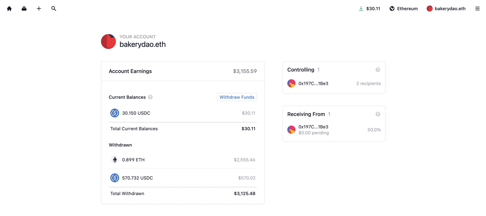

# 🔄 0XSPLITS

The Bakery DAO and its framework has a beautiful synergy with 0xSplits, a protocol for gas-efficient splitting of on-chain income. 0xSplits is an [open-source](https://etherscan.io/address/0x2ed6c4b5da6378c7897ac67ba9e43102feb694ee#code), [audited](https://github.com/0xSplits/splits-contracts/blob/main/audit/0xSplits\_A-1.pdf), and non-upgradeable protocol for efficiently splitting on-chain funds amongst multiple addresses. Each recipient gets their share, and one user can withdraw for all users in the split.

Our Pastry NFTs will be configured in many special ways with this... The beneficiary of the pastry NFT contracts are currently set to a 0xSplits contract. This means that all purchases made for the Pastry NFT will be distributed to addresses included in the split.

In the near future, this will support a split, whereas revenue is split amongst all addresses holding a particular NFT. This will become especially useful for sharing of on-chain income as the Bakery grows and decentralizes...

**0xSplits turns us into the perpetual alpha-leaking machine.**
