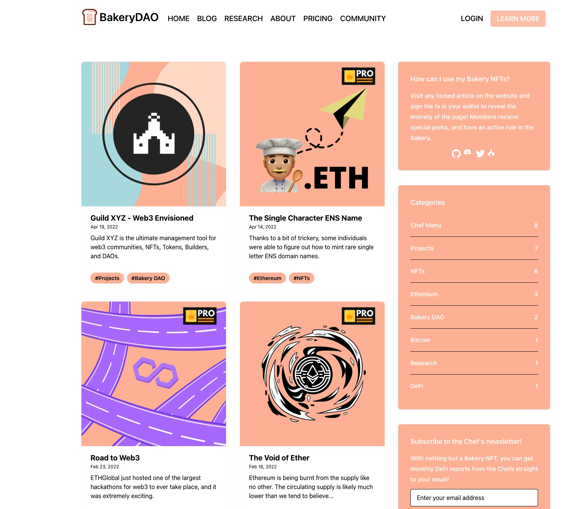
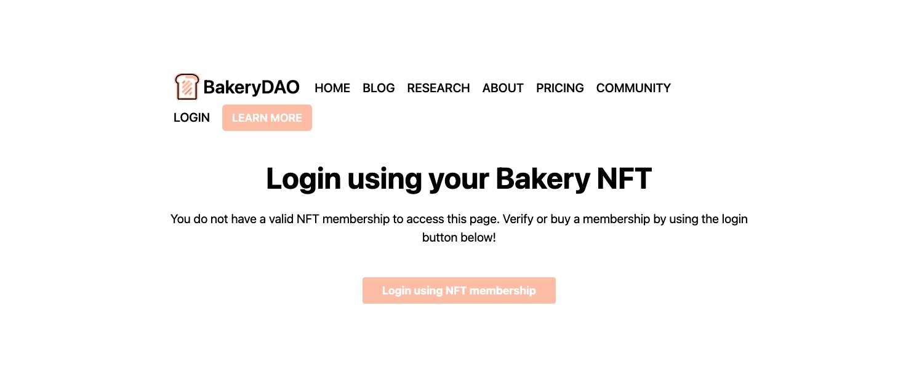

# 🍰 PASTRY XYZ

The Bakery DAO website, [https://pastry.xyz/](https://pastry.xyz) is the prime product of the Bakery DAO. Using the unique features of our NFTs, we have created a token-gated research hub where only the best alpha is accessible to the community (Pastry NFT holders).

Sounds simple on the surface, right? Let's dive into the underlying functions to see what's going on under the hood...&#x20;

When users enter the [https://pastry.xyz/](https://pastry.xyz) website, they will see the following page:

Users who are not yet members are able to freely browse the content under the "Home, Blog, About, and Pricing sections. This is where the Chefs post various research reports regarding all topics in DeFi.

The Bakery will drop interviews, analytics, and interesting insights or educational content for all to view here.

However, if you're looking for more in-depth and tasty alpha, you will want to look at the Research and Community sections.

Under each of these pages, a brief introduction of research articles will be shown... However, these aren't just any articles.

When someone who is not a member goes to click on one of these articles, they will be prompted verify their pastry NFT membership. This requires a simple signature from the Ethereum wallet with the NFT, and then the user will be returned to the full research article upon verification. If they are not already a member, they will be prompted to purchase the pastry NFT.

Once your membership status on the application is confirmed, a whole new world of possibilities opens up. By visiting your profile section at the top right of the screen, you'll be able to customize your account display for the Bakery.

Furthermore, pastries will have the option to add their own research reports locked behind the pastry NFT, as simple as the click of a few buttons!

We use cookies and cryptographic signatures to verify members of the site, and serve different content based on server-side props passed from the browser. This allows for a seamless and unbeatable UX!
