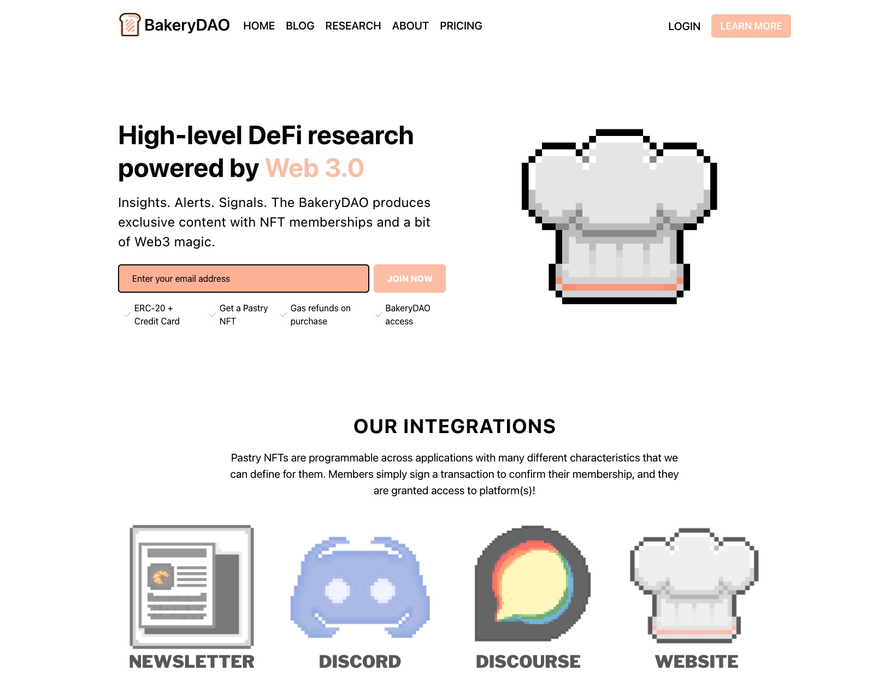
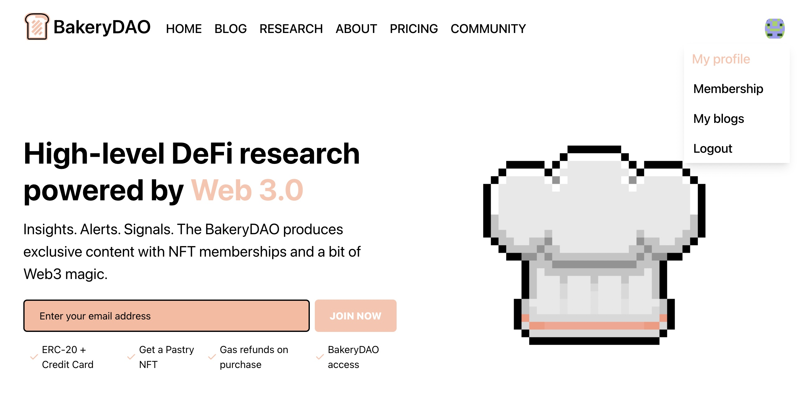
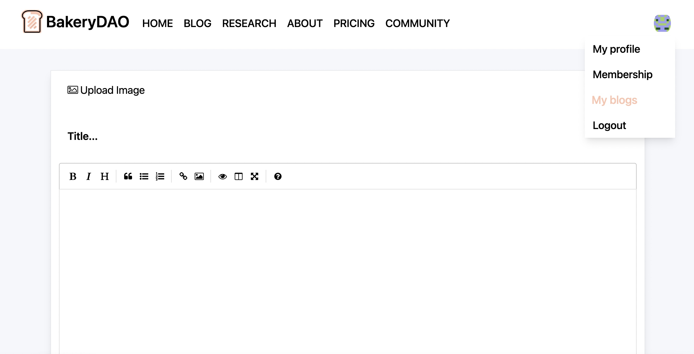

# 🍰 PASTRY XYZ

The website, or [pastry.xyz](https://pastry.xyz), is the primary product for the Bakery DAO. Using some incredible features of NFTs, we built the framework for a token-gated research hub where only the best alpha is accessible to the community (Pastry NFT holders).

Sounds simple on the surface, right? Let's dive into the underlying functions to see what's going on under the hood...&#x20;

When users enter the [Pastry XYZ](https://pastry.xyz) application, they will see the following page:

Users visiting that are not yet members are able to freely browse the content under the **Home**, **Blog**, **About**, and **Pricing** sections. This is where the Chefs post various research reports on different topics in DeFi and NFTs.

The Bakery will additionally drop select interviews, analytics, interesting insights, and educational content for all to view here. However... If you're looking for more in-depth and tasty alpha, you will want to look at the **Research** and **Community** sections.

Under each of these pages, a brief preview of special articles will be shown... **But these aren't just any articles.**

When someone who is not a member goes to click on one of these links, they will be prompted verify their pastry NFT membership. This requires a simple signature from the Ethereum wallet with the NFT, and then the user will be returned to the full research article upon verification. If they are not already a member, they will be prompted to purchase the Pastry NFT.

This effectively token-gates top tier research to only members of the Bakery who have proven their worth.

Once your membership status on the application is confirmed, a whole new world of possibilities opens up. By visiting your profile section at the top right of the screen, you'll be able to customize your account that is displayed for the Bakery.

Furthermore, every pastry has the option to add their own research reports locked behind the Pastry NFT, as simple as the click of a few buttons! Limit of one post per day. This can be done under the profile section, after clicking "My Blogs."

These community-written articles will be displayed on the "Community" section page under the navigation menu, acting as token-gated articles for only pastries to view! In the future we will expand customization options for creators to choose their own parameters for monetization. The checkout can be personally configured.

We use cookies and cryptographic signatures to verify members of the site, and serve different content based on server-side props passed from the browser. This allows for a seamless and unbeatable UX!
