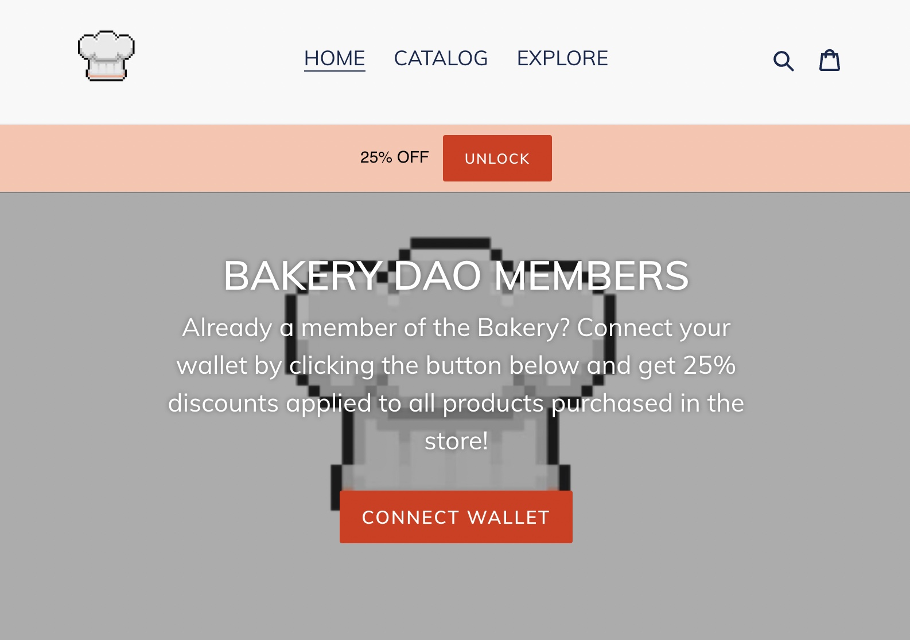
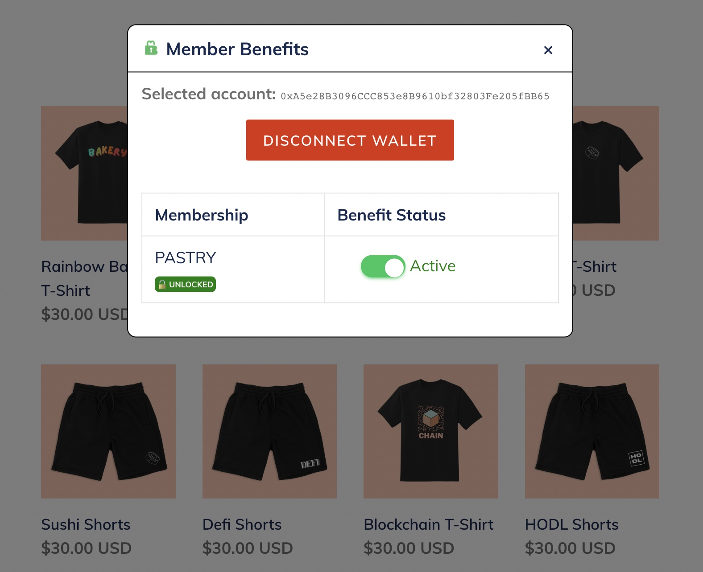
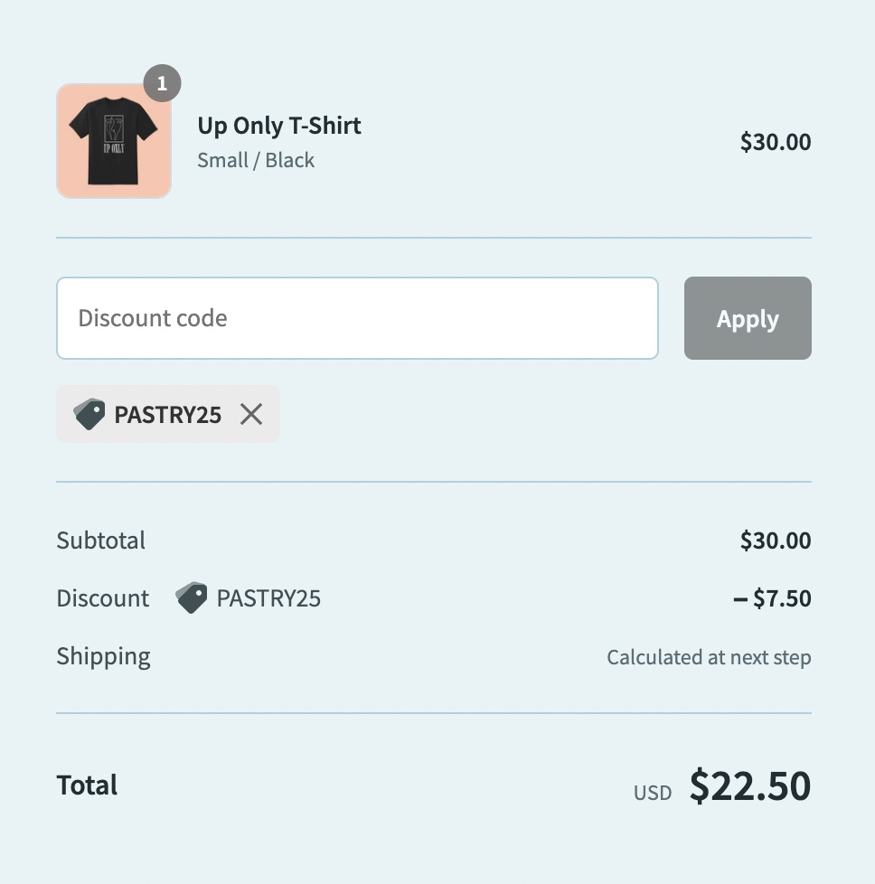
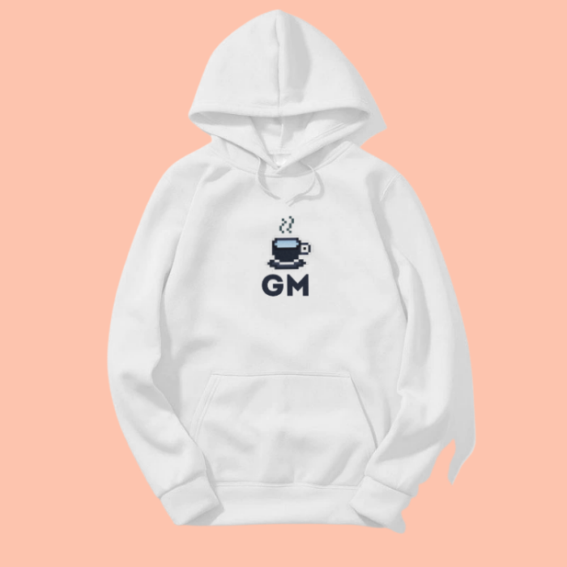
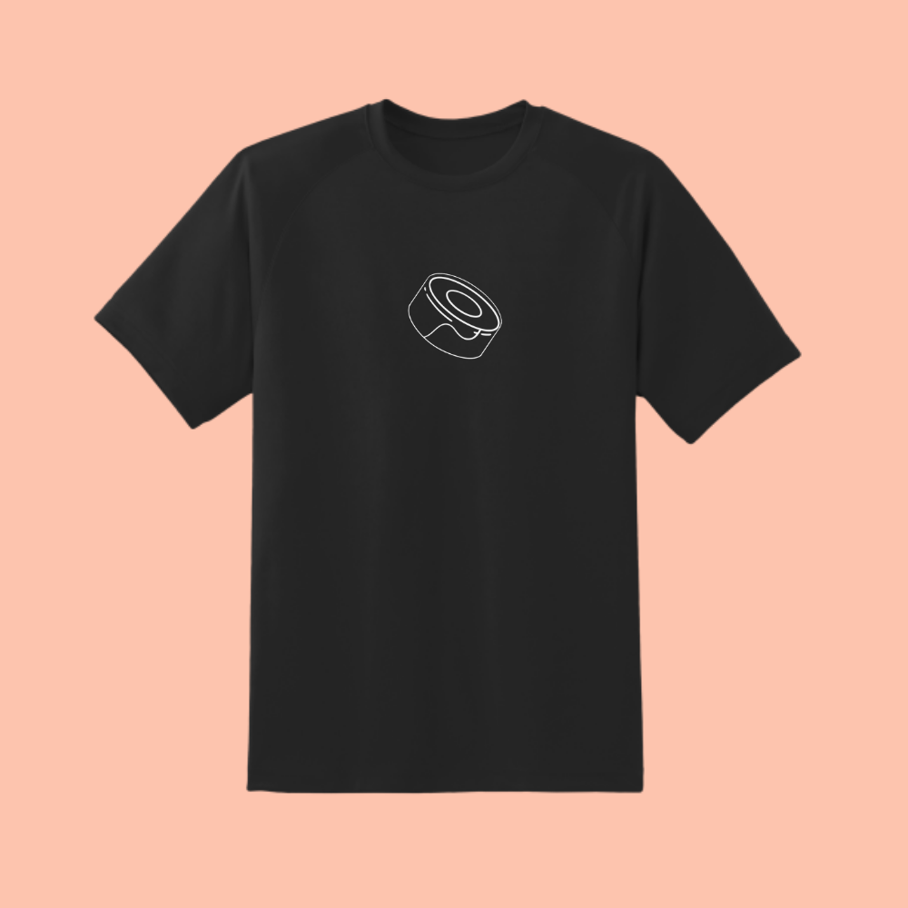

# 🛍 SHOPIFY

The Bakery merchandise store is bringing swag back to DeFi. We plan to do this with several rollouts, each one larger than the last. The first iteration of the shop will feature a collection of all of the hottest DeFi protocols, and items to rapport them. The kicker?

Every Pastry NFT holder gets an automatic 25% OFF all items once connected to their Ethereum wallet. The store will have an option to unlock the discount at the top of the homepage.

After clicking "unlock" or "connect wallet," users will be prompted to sign a transaction in their wallet. Once confirmed, it will redirect the user back to the application with the discount code automatically applied at checkout.

After browsing all of the items you wish to purchase, navigate to the final checkout screen to follow through with the order. This is where you will actually see the Pastry NFT discount being automatically applied to all of your items.

If everything looks correct for your order, you can begin to enter the necessary information to receive your items. Congratulations! You now have some DeFi swag...

 

The next deployment of the Bakery Shop will be a slight bit more "web3 friendly." What does this mean? The Chefs are actually working to build out a store powered by the blockchain.

Items are NFTs. Like [unisocks](https://unisocks.exchange/), they can be burnt to redeem the physical items and have them shipped. This will require a special checkout configuration involving private NFT metadata signed by the user that is attributed to each NFT.

This will let us enable purchases in various partner ERC-20 tokens, and create some interesting opportunities. The Bakery DAO will gamify the DeFi fashion scheme.

The last and final version of the Bakery Shop will introduce a bit of a twist with the metaverse. Each NFT, on top of being a clothing item, will be a 3D-rendered version of itself, existing in the Metaverse until burnt and redeemed by the owner.

Furthermore, we plan to collaborate with various NFT artists and projects to rollout monthly drops including exclusive 1/1 pieces created by the community.

Stay tuned...
