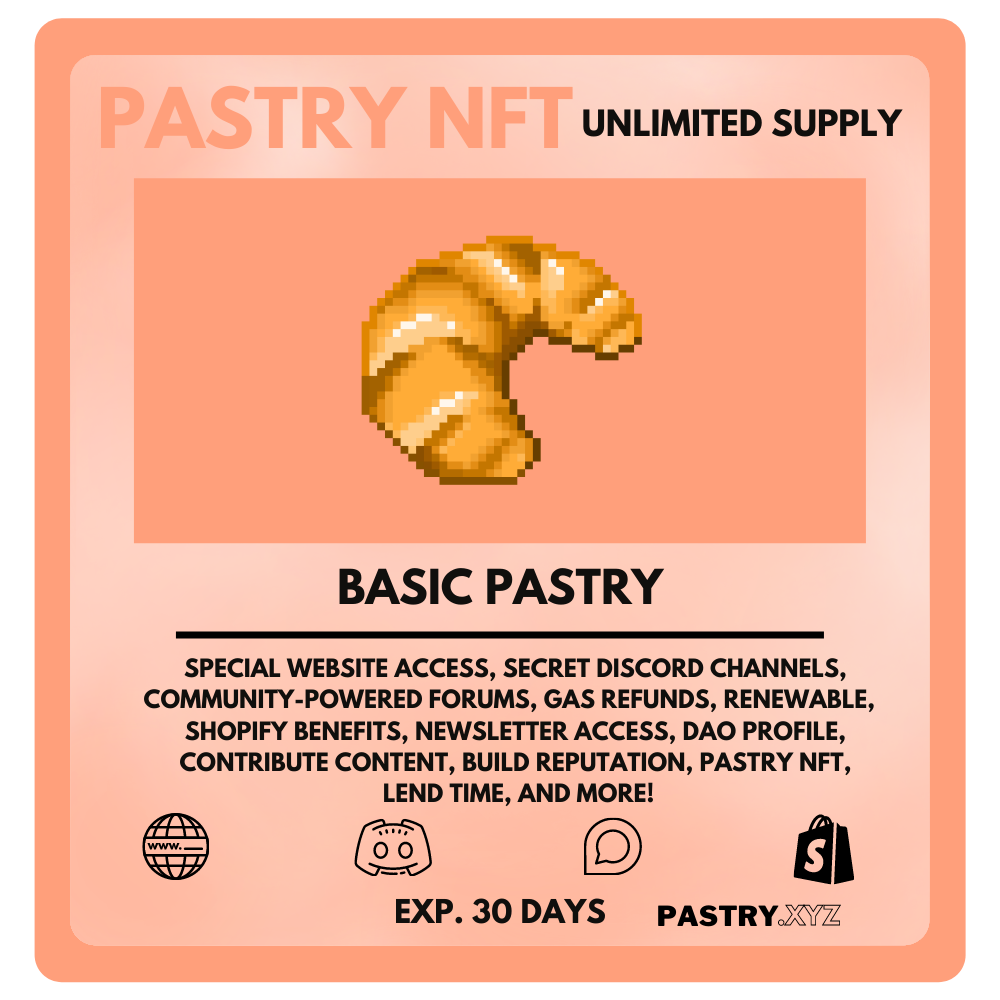

# 🧁 PASTRY NFT

### Pastry NFT

The Pastry NFT is your first-stop access to the BakeryDAO and all of its features. It is cheaper than the other tier, the "Pastry VIP" NFT. This is because they expire depending on a block timestamp recorded upon purchase. They are also unlimited in supply, but offer some very cool features we're excited to share with you all.&#x20;

Instead of just a cute little spinning pastry, these NFTs actually have a wide range of functionality off of the bat.

**Lending** - Contrary to your every day NFT, the Pastry NFT has a shareKey() function which can be called to lend time of your membership to an address of your choice, while retaining complete ownership of the token.

**Refunds** - Not a fan of our content? That's okay! Get a pro-rated refund within a specific time frame and get all of your funds back instantly by simply burning NFT!

**Gas** **Refunds** - The newest version of the Pastry NFTs now automatically refund a portion of gas upon purchase, on top of the already minted Unlock Discount Tokens. This has reduced gas costs for users tremendously.

**Layer** **Two** - Pastry NFTs are deployed on several layer two networks, and this will continue to grow as more scalability solutions released. Right now they are live on Optimism, Polygon, and the Ethereum main-net.

**Hooks** - These are smart contract extensions that allow us to customize the behavior of the Pastry NFTs upon purchase. This can include things like discount codes, variably-priced NFTs, or even include a check to determine whether or not a user is valid member off of arbitrary logic that we define beforehand.

**Permissions** - the Pastry NFT contracts can have multiple "holders," that each have a role set by the tokens owner. They will be able to define different parameters on their token for the maximum customization.

**Upgrades -** Pastry NFTs are now upgradeable! This means that they can benefit from future improvements made to the protocol, without requiring deployment of a whole new contract.
