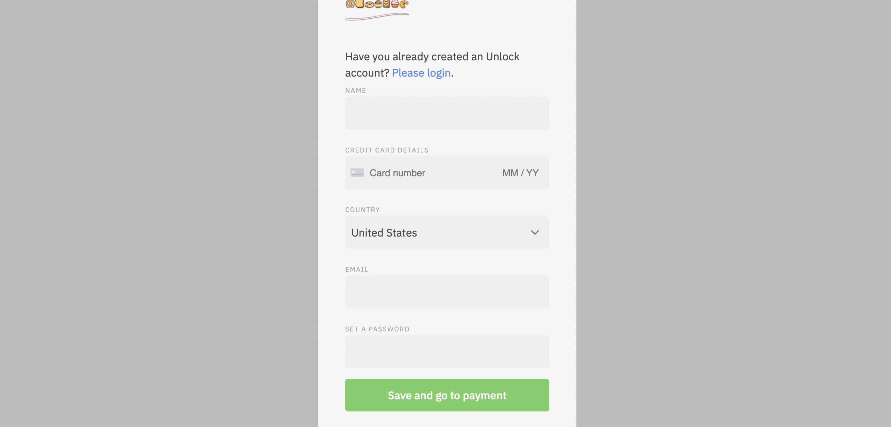

# 💳 CREDIT CARDS

The Bakery wants to onboard as many users as possible into the Ethereum ecosystem. This is why we have enabled credit card purchases on Pastry NFTs, with some cool features working behind the scenes making it all possible. Users who are curious, but not exactly comfortable with DeFi and wallet management may partake without risk.

It relies on [Stripe Connect](https://stripe.com/connect), meaning that you will receive payments "off-chain" directly on the bank account that you have set up with Stripe.

Next, we deployed a KeyPurchaser contract to allow the granting of memberships to users once their purchase has been confirmed.

Getting started with a credit card:

Visit any locked page on the pastry xyz website, or hit login at the top right to be prompted with the checkout screen for the Bakery. From this screen, instead of hitting the wallet button on the left, hit "purchase with a credit card."

While you are waiting for Stripe's final approval, you can perform the last step: giving Unlock Inc. the ability to grant keys to users whose credit card payment has been successfully processed (see [roles](https://docs.unlock-protocol.com/developers/smart-contracts/lock-api/access-control)). Once Unlock Inc. has charged your member's card, we will then send them the NFT so that they can use it to prove their membership. In order to do this, we need a lock manager to grant us the role of "key granting". This role can be revoked at any point (but this will disable credit card payments) and we do not receive any permission or capability on your lock.
