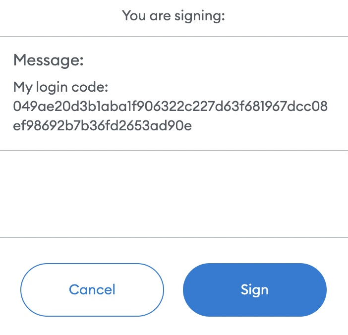
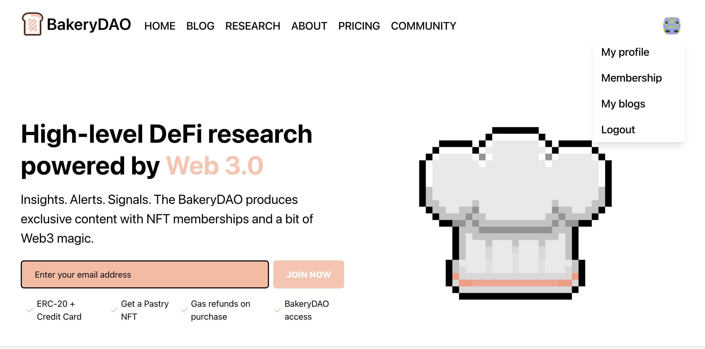

# 🔌 LOGGING IN

The Pastry NFT is proud to be using an implementation of the [Sign-In With Ethereum](https://docs.unlock-protocol.com/unlock/developers/sign-in-with-ethereum) ([EIP4361](https://eips.ethereum.org/EIPS/eip-4361)) specification! This is the most secure and powerful EIP for web3 to date. Allow us to explain what this is and why it is so powerful...

All of our integrations use a simple verification mechanism with NFTs, confirming a cryptographic signature from a valid address and storing the users session in the browser unless logged out. You can log in to the main website by visiting any locked page.&#x20;

This includes the Login section at the top right of the screen below, and both the Community and Research pages on the navigation bar.

Each message contains human-readable input so the user knows exactly what message they are signing on their wallet. Immediately after signing the message, a member will be redirected to the appropriate URL.

After logging into the website, you'll notice a "blockie" profile picture attributed to your Ethereum account, generated by your address. This button is a link leading to a drop down menu with some options for customization.

In addition, the research and community sections under the navigation bar will be completely unlocked for viewing.

The Bakery verification flow is similar to the frequently used **OAuth** & **OpenId Connect** flows, made specifically so that other applications who only need to _know_ of the user's address do not have to worry about handling web3 providers, but can still identity users.

All of this makes it trivial for different applications to build "authentication" URLs with a **redirect scheme** that allows even native applications to easily identify a user's address. We have tons of integrations on the way.
