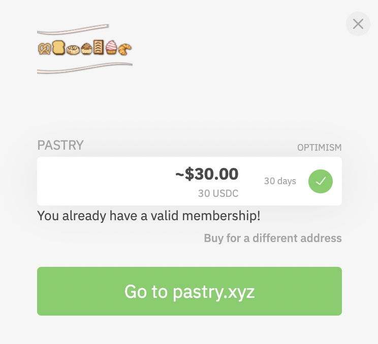

# 🔴 OPTIMISM

.png>)

Since many of you may wish to avoid unnecessarily high gas fees on the Ethereum network, we’ve contrived a simple explanation of how to get started with the Bakery DAO quickly and cheaply with a Ethereum wallet.

If you don’t have a Ethereum wallet, head over to Metamask.io to get started with their browser extension or mobile app. From there, select the network at the top of the page of the app.

.png>)

You will see a screen like this (minus a few networks if you haven’t connected before). Select the “Add Network” button seen in the image below:

.png>)

A page where you can enter in the specific connection parameters will appear, and you’re nearly done!

.png>)

Enter these items in the details, then hit “Save.”

**Network Name:** Optimistic Ethereum\
**New RPC URL:** [https://mainnet.optimism.io](https://mainnet.optimism.io/)\
**Chain ID:** 10\
**Currency Symbol:** ETH\
**Block Explorer URL:** [https://optimistic.etherscan.io](https://optimistic.etherscan.io/)&#x20;

Congrats! You should be connected to the Optimistic Ethereum network, a faster and cheaper layer two network built on top of Ethereum’s base security layer, utilizing the functions of optimistic rollups. You can do everything you wish to on this network just like the Ethereum network, at a fraction of the cost!

To quickly get started with the Pastry NFT, you can then visit [Hop Exchange](https://hop.exchange/), a layer two dapp which allows for nearly instant swapping of Ethereum across different optimistic rollups. You can swap mainnet ETH to Optimistic ETH and back while avoiding the wait times for bonding when using the bridge.

After inputting the amount of Ethereum you want to swap from mainnet to optimism in the options, continue with the swap like you would with Uniswap. The transaction will take a few minutes to go through.

.png>)

Once confirmed, head back over to your wallet and make sure you are on the Optimistic Ethereum network. Then visit [this link](https://bakerydao.me/website) to to continue with the purchase of the Pastry NFT on Optimism.

.png>)

Select the Optimism Pastry NFT option, then proceed to connect to your Ethereum wallet while on the Optimistic Ethereum network.

.png>)

Once connected, you’ll see a page to complete the purchase of the NFT you selected. Complete by clicking the “Wallet” option and confirming the transaction in your Ethereum wallet once prompted.

.png>)

In a few seconds, you will receive a Pastry NFT minted to your address, and then immediately have access to all of the features of the BakeryDAO.

If you have any questions or issues, let us know and we would be glad to help. And as always, welcome to the BakeryDAO! We are glad to have you here!
