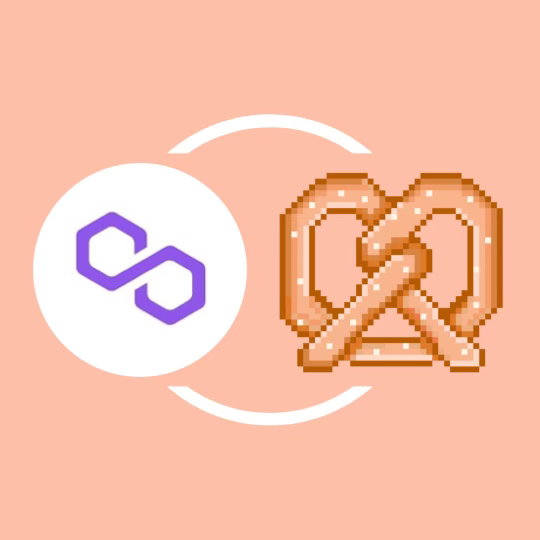

# 🔗 POLYGON

Since many of you may wish to avoid unnecessarily high gas fees on the Ethereum network, we’ve contrived a simple explanation of how to get started with the Bakery DAO quickly and cheaply with a Ethereum wallet.&#x20;

If you don’t have a Ethereum wallet, head over to Metamask.io to get started with their browser extension or mobile app. From there, select the network at the top of the page of the app.

 (1) (1).png>)

You will see a screen like this (minus a few networks if you haven’t connected before). Select the “Add Network” button seen in the image below:

 (1).png>)

Next, you'll see a page where you can enter in the specific connection parameters, and you’re nearly done!

 (1).png>)

Enter these items in the details, then hit “Save.”

**Network Name:** Polygon Mainnet\
**New RPC URL:** [https://polygon-rpc.com/](https://polygon-rpc.com)\
**Chain ID:** 137\
**Currency Symbol:** MATIC

**Block Explorer URL:** [https://polygonscan.com/](https://polygonscan.com)

Congrats! You should be connected to the Polygon Mainnet. You can do everything you wish to on this network just like the Ethereum network, at a fraction of the cost!

To quickly get started with the BakeryNFT, you can then visit [Hop Exchange](https://hop.exchange), a layer two dapp which allows for nearly instant swapping of Ethereum across scaling solutions. You can swap mainnet ETH to Polygon ETH and back while avoiding the wait times for bonding when using the bridge.

After inputting the amount of Ethereum you want to swap from mainnet to Polygon in the options, continue with the swap like you would with Uniswap. The transaction will take a few minutes to go through.
