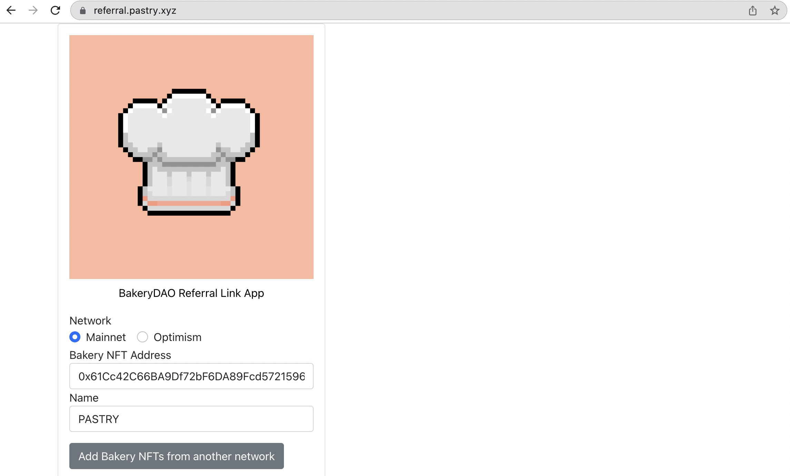

# 🎀 REWARDS

 (1) (1).png>)

Our checkout can easily be integrated and configured in the way the user sees fit, and users can even generate their own 'referral' links to advertise content locked behind the Pastry NFTs, and get a small percent of each purchase through their URL.

We additionally have a referral link generation webpage at [referral.pastry.xyz](https://referral.pastry.xyz). Using our simple form interface, users can easily generate these referral links and get automatic rewards for their help sharing!



The Bakery `paywallConfig` is a JSON object which includes a set of customizations for your experience. It includes the following elements:

* `locks` : _required object_, a list of lock objects (see below).
* `icon`: _optional string_, the URL for an icon to display in the top left corner of the modal.
* `callToAction`: _optional object_, a list of messages shown based on the state of the checkout modal (see below).
* `metadataInputs`: _optional array_, a set of input fields as explained there.
* `persistentCheckout`: _optional boolean_: `true` \_\_if the modal cannot be closed, defaults to `false` when embedded. When closed, the user will be redirected to the `redirect` query param when using a purchase address (see above).
* `useDelegatedProvider`: _optional boolean._ To be announced.
* `network`: _optional integer._ defaults to `1`. See below.
* `referrer`: _optional string_. The address which will receive discount tokens (if the transaction is applicable)
* `messageToSign`: _optional string_. If supplied, the user is prompted to sign this message using their wallet. If using a checkout URL, a `signature` query param is then appended to the `redirectUri` (see above). If using the embedded paywall, the `unlockProtocol.authenticated` includes the `signature` attribute.
* `pessimistic`: _optional boolean._ defaults to `false`_._ By default, to reduce friction, we do not require users to wait for the transaction to be mined before offering them to be redirected. By setting this to `true`, users will need to wait for the transaction to have been mined in order to proceed to the next step.

**An example of how this can be customized:**

```
{
    "pessimistic": true,
    "locks": {
        "0x61Cc42C66BA9Df72bF6DA89Fcd57215965f74005": {
           "network": 1,
           "name": "BakeryNFT"
        }
    },
    "icon": "https://bakery.fyi/wp-content/uploads/2022/01/1-5.png",
    "callToAction": {
        "default": "Are you ready to join the BakeryDAO?"
    },
    "metadataInputs": [
        {
            "name": "Name",
            "type": "text",
            "required": true
        }
    ]
}
```

Here are some of our generated URL's (thrown through a url shortener to look prettier), which each serve as paywalls to the Pastry NFT, but have different behaviors including the redirect link, metadata inputs (for newsletter), and logos to display.

| WEBSITE                                                | NEWSLETTER                                                                                                                                                                                                                                                                    | DISCORD                                  |
| ------------------------------------------------------ | ----------------------------------------------------------------------------------------------------------------------------------------------------------------------------------------------------------------------------------------------------------------------------- | ---------------------------------------- |
| ****[**https://pastry.xyz/**](https://pastry.xyz/)**** | [SUBSCRIBE](https://newsletter.unlock-protocol.com/?title=The%20Chefs%20Menu\&description=A%20monthly%20newsletter%20serving%20up%20the%20hottest%20news%20in%20DeFi.\&locks=10x61Cc42C66BA9Df72bF6DA89Fcd57215965f74005\&locks=100x73fc36bA5684655807F60a6437463cC527f50027) | [CHAT NOW](https://bakerydao.me/discord) |
