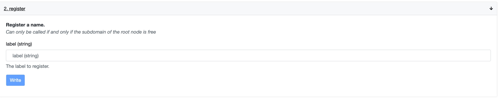
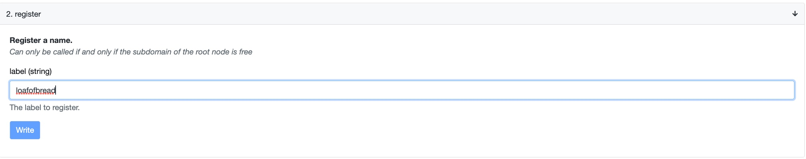

# 🪅 SUBDOMAIN

Find the register function after following this link (function #2): [https://etherscan.io/address/0x2d3a1bcb82db7a977e0b0dabb192862c2dd027d5#writeContract](https://etherscan.io/address/0x2d3a1bcb82db7a977e0b0dabb192862c2dd027d5#writeContract)&#x20;

Next, insert the ENS name you wish to claim in the format of the example provided below. After clicking "write" and confirming the transaction in your wallet, the new ENS name will be owned by your address!&#x20;

To have it appear elsewhere as your web3 username (+ bonus points), visit: [https://app.ens.domains/address/](https://app.ens.domains/address/)\<your-address-here> You will see a dropdown to select the new username you just acquired. Select it + hit save, then confirm the transaction in your wallet.

.png>)

**Congratulations, you now have a BakeryDAO subdomain!**

**If you're having troubles, follow the steps provided in the GIF below:**\
