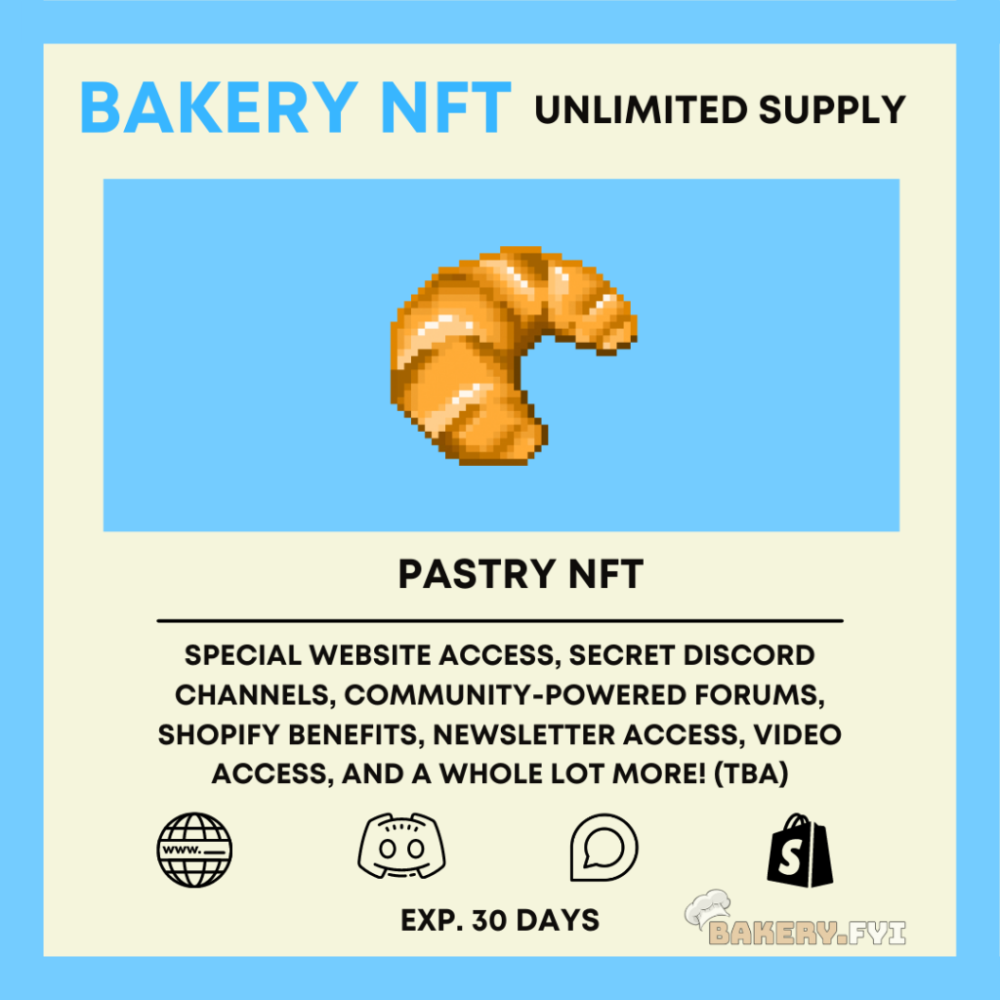
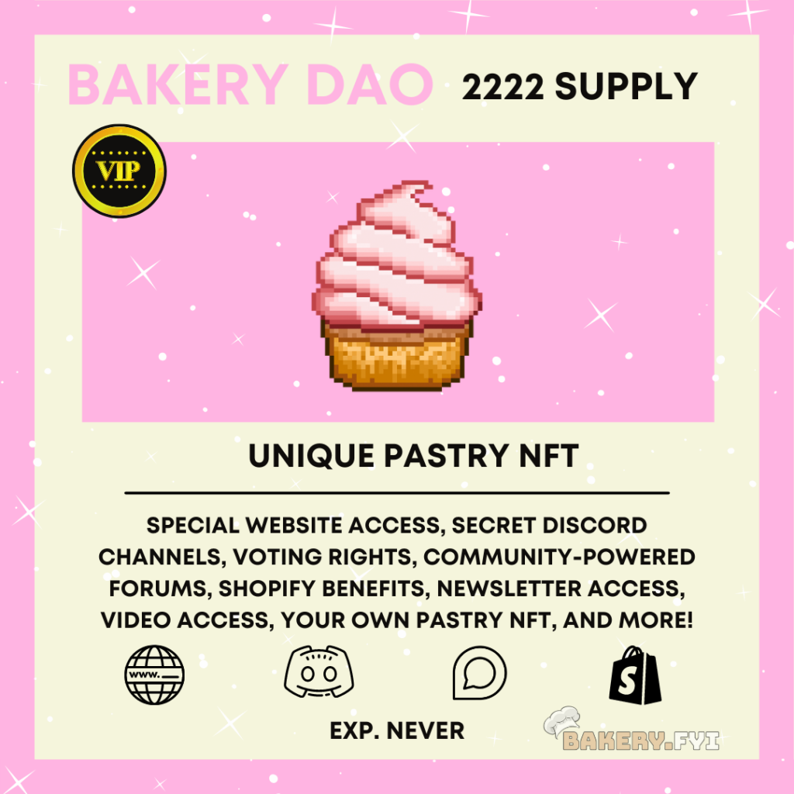

# 🏆 What are the tiers?

**The Bakery NFTs come in two forms; the Bakery NFT and the BakeryDAO NFT.** Each have their own functions.

### BakeryNFT

This is an unlimited supply NFT with a pre-defined expiration date that is generated with a block timestamp upon purchase. The NFT is available in both 30 day and 60 day memberships, which give access to exclusive content on the Bakery website, forum, private discord, newsletter and telegram for the specified time duration.

Here are some of its functions:

**Lending** - Contrary to your every day NFT, the Bakery NFT has a shareKey() function which can be called to lend time of your membership to an address of your choice, while retaining complete ownership of the token.

**Refunds** - Not a fan of our content? That's okay! Get a pro-rated refund within a specific time frame and get all of your funds back instantly by simply burning the token!

**Gas** **Refunds** - The newest version of the Bakery NFTS now automatically refund a portion of gas upon purchase, on top of the already minted Unlock Discount Tokens. This has reduced gas costs for users tremendously.

**Layer** **Two** - BakeryNFTs are deployed on several layer two networks, and this will continue to grow as more scalability solutions released. Right now they are live on Optimism + the Ethereum mainnet. Arbitrum support is coming soon.

**Hooks** - These are smart contract extensions that allow us to customize the behavior of the BakeryNFTs upon purchase. This can include things like discount codes, variable priced NFTs, or even a check to determine whether or not a user is valid member off of arbitrary logic that we define beforehand.

**Permissions** - the BakeryNFT contracts can have multiple "holders," that each have a role set by the tokens owner. They will be able to define different parameters on their token for the maximum customization.

### BakeryDAO

The BakeryDAO NFT is an NFT with a fixed supply of 2,222. Each NFT comes with a unique pastry, and acts as a lifetime membership to content across all of our platforms, as well as the ability to create and vote on proposals made by other BakeryDAO holders. These can be used to eventually vote on whether or not BakeryDAO NFT holders receive dividends from the sales of Bakery NFTs, price changes, future integrations, and more...

There will only be 2,222 BakeryDAO tokens. They are **not** live yet, but once they are they will be only for the finest of pastries. The Bakery plans to allocate the majority of the supply to the best subscribers of the Bakery NFTs, who have proved their dedication to the BakeryDAO since the very beginning.

