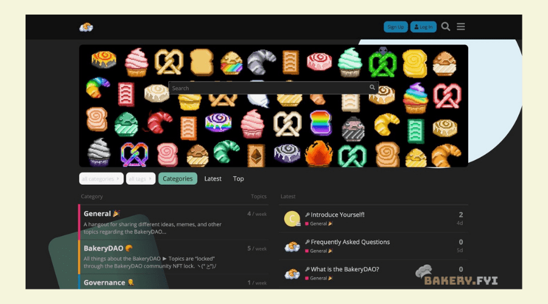
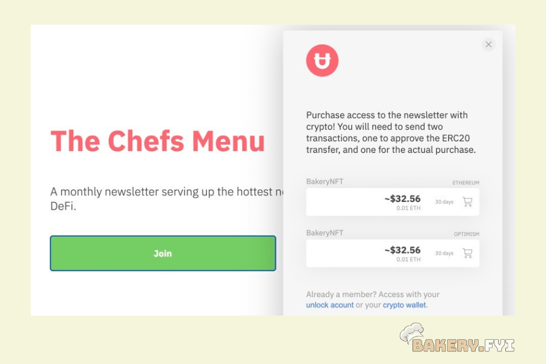

# ✍ What is the BakeryDAO?

.png>)

The Bakery DAO is a collective of anonymous crypto enthusiasts, researchers, and writers dedicated to finding the latest alpha. Through the use of NFTs, the Bakery DAO has created an ecosystem that aligns community and creator interests through crypto economic incentives across our platforms.

Our NFTs are currently integrated with:

1. [bakery.fyi](https://bakery.fyi)&#x20;

.jpg>)

2\. [discord](https://discord.gg/bakerydao)

.jpg>)

3\. [discourse](https://bake.community)

4\. [newsletter](https://bakerydao.me/newsletter)

5\. [telegram](https://alpha.guild.xyz/bakerydao-telegram)

6\. [snapshot](https://vote.bakery.fyi/#/)

7\. shopify (coming soon)

8\. decentraland (coming soon)

Since the community consists of holders of the Bakery NFT, and grant access to it, they are incentivized to share more alpha in the community, therefore making the NFT memberships more valuable.&#x20;

Additionally, since the Chef's, or content creators, are rewarded monetarily for each purchase of an NFT membership, they are incentivized to write better content/research.&#x20;
