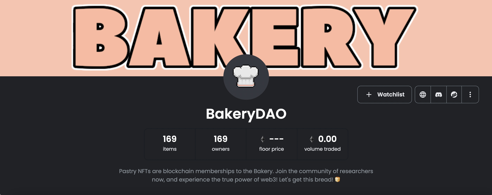

# 🤳 How to resell a membership?

Because Bakery NFTs use the NFT ERC-721 standard, you can easily sell or transfer ownership of a membership (we call them keys!) once you have purchased it.Here’s how you can list one of your keys on an NFT marketplace platform like Opensea for resale.

1. 1.After you have purchased a BakeryNFT, and it is in your wallet, log in to [Opensea](https://opensea.io).
2. 2.Click “My Profile” and you should see you "**Bakery NFT"**
3. 3.Click the NFT you want to sell, and then click “Sell”
4. 4.From the next window, you can choose how you would like to resell your NFT. This can be done with either ETH, USDC, or DAI -- and with either a set price or a bidding function.

