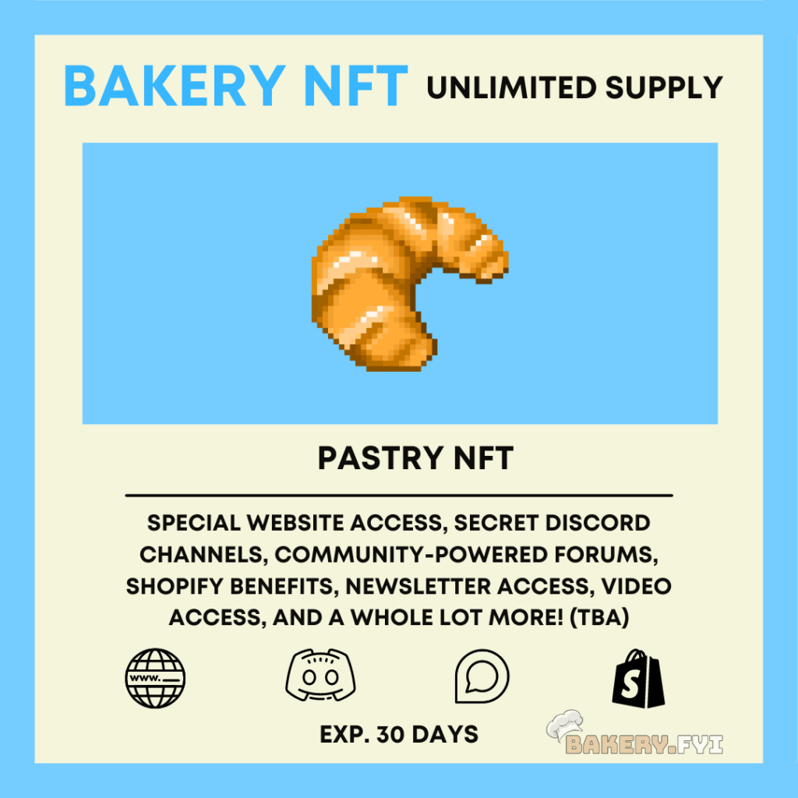
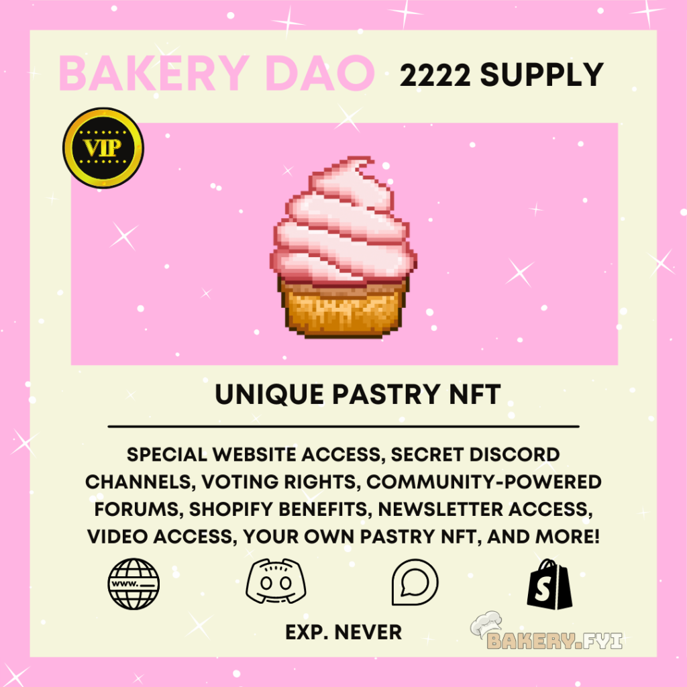
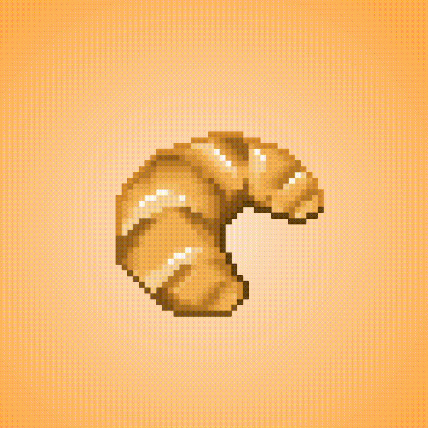

# 🥖 Bakery NFT

So many pastries, so many choices... The BakeryDAO is powered by several NFTs, each unique in their own way. In order to have memberships - while keeping the group exclusive, we approached this with a dual-token model in mind.

I'll explain them in-depth below:

 

### Bakery NFT

The BakeryNFT is your first-stop access to the BakeryDAO and all of its features. It is cheaper than its cousin counterpart, the "Bakery DAO" NFTs. This is because they expire depending on a block timestamp recorded upon purchase. They are also unlimited in supply, but offer some very cool features i'm excited to share with you all.

Instead of just a cute little spinning pastry, the NFTs actually have a wide range of functionality off the bat.



**Lending** - Contrary to your every day NFT, the Bakery NFT has a shareKey() function which can be called to lend time of your membership to an address of your choice, while retaining complete ownership of the token.

**Refunds** - Not a fan of our content? That's okay! Get a pro-rated refund within a specific time frame and get all of your funds back instantly by simply burning the token!

**Gas** **Refunds** - The newest version of the Bakery NFTS now automatically refund a portion of gas upon purchase, on top of the already minted Unlock Discount Tokens. This has reduced gas costs for users tremendously.

**Layer** **Two** - BakeryNFTs are deployed on several layer two networks, and this will continue to grow as more scalability solutions released. Right now they are live on Optimism + the Ethereum mainnet. Arbitrum support is coming soon.

**Hooks** - These are smart contract extensions that allow us to customize the behavior of the BakeryNFTs upon purchase. This can include things like discount codes, variable priced NFTs, or even a check to determine whether or not a user is valid member off of arbitrary logic that we define beforehand.

**Permissions** - the BakeryNFT contracts can have multiple "holders," that each have a role set by the tokens owner. They will be able to define different parameters on their token for the maximum customization.

****[**Recurring** **Memberships**](https://unlockprotocol.notion.site/Recurring-memberships-09bff51bd99b4f74bd6b03f29070eaf6) **-**&#x20;

1. A subscriber will need to approve the contract to spend the total amount of the memberships from their balance on the ERC20 contract (eg. subscribing to a membership with 12 monthly payments of 5 USDC requires the user to pre-approve a total debit of 60 USDC from its wallet over a year).
2. The user will _need_ to perform the “first” purchase on the BakeryNFT to enable the recurring purchases from then on after. For everything after that point (or any other “explicit” purchase by the user), the price AND duration are stored for this wallet address as a “proof” that they agreed to this price/duration. Everything else remains the same in the function.
3. Once this first purchase expires (or is nearly expired - within 5% of expiration date), _anyone_ can call the `renewMembershipFor` function for this user’s key. The function will verify that the price and duration are unchanged from purchase above (or the tx will fail) and that the ERC20 approval is still sufficient (or the tx will fail). The `renewMembershipFor` function should use the token id as argument as well as he referrer address. This function will first verify that the current membership is nearly expired, and that the price/duration are unchanged. It will then perform the same behavior as a purchase by withdrawing from the key owner’s ERC20 balance and update the duration. Note: the `onPurchase` hook should be called, as well as the gas refund mechanism. If the transaction succeeds, the gas refund is triggered for the `msg.sender`.

This will require a background job whose purpose is to identify different all of the Bakery NFTs (memberships) that are about to expire and are renewable (because the users had previously approved the right amount + still has enough funds for purchase). Almost immediately after a user in this category have been identified, our membership purchaser contract would need to trigger a `renewMembershipFor` for the specific NFT.

**Note**: the same background job can be used for credit card purchases that are set to be recurring.

**Upgrades -** the latest version of Bakery NFTs are now upgradeable! This means that they can benefit from future improvements made to the protocol, without requiring deployment of a whole new contract.

### Bakery DAO

With the BakeryDAO NFT, things get just a slight bit different, but certainly not in a bad way. The BakeryDAO tokens are the most exclusive bunch of pastries. They have voting rights in the ecosystem, share revenue generated from all of the content, and have unlimited access to the BakeryDAO.

They also come with their own unique pastry, having individual rarities and components to explore and discover!

.GIF>)

Holders of these tokens will generate yield in time from the memberships, which they can send to their friends, sell on the secondary market, lend, or do many other things with! These NFTs do not come with an expiration timestamp, but they are deemed valid as memberships via the smart contract we mentioned previously called [ERC721BalanceOfHook](https://github.com/unlock-protocol/unlock/blob/master/smart-contracts/contracts/hooks/ERC721BalanceOfHook.sol).

The magic all happens in this one line of code where it calls the `getHasValidKey` function on the relevant smart contract.

```js
const hasValidKey = await lockContract.getHasValidKey(userAddress)
```

In addition to all of this, the Bakery plans to award these token holders with their own BakeryDAO ENS subdomain. This will later be used on the [https://pastry.xyz/](https://pastry.xyz) website where you will have specific permissions only when connected with a valid Ethereum wallet. These can be permissions such as drafting your own post, editing an existing research report, and much more to be announced on a later date...

There will only be 2,222 BakeryDAO tokens. They are **not** live yet, but once they are they will be only for the finest of pastries. The Bakery plans to allocate the majority of the supply to the best subscribers of the Bakery NFTs, who have proved their dedication to the BakeryDAO since the very beginning.

More info in the next section...
