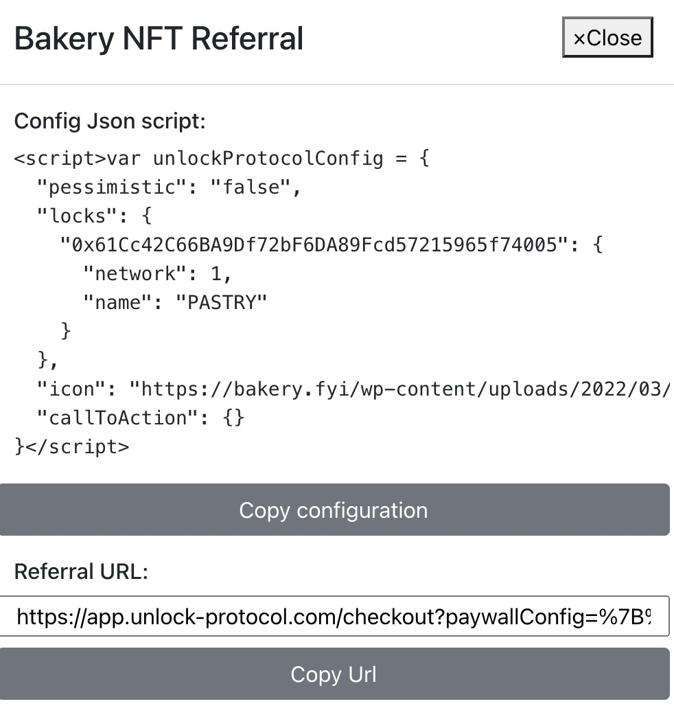
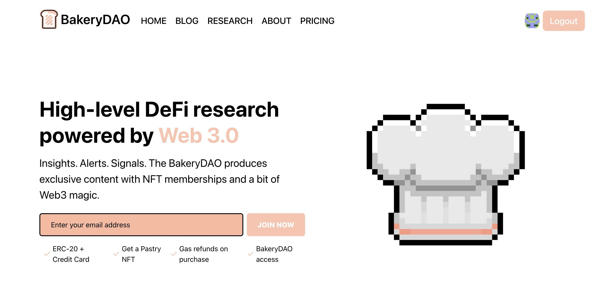

# ✅ Authentification

The Bakery embeds a checkout for our pastry NFT memberships via JavaScript APIs, and we provide a simple interface for consumers to purchase corresponding NFTs, or even generate their own customizable links!

.png>)

Our approach is similar to the frequently used **OAuth** & **OpenId Connect** flows, so that other applications who only need to _know_ of the user's address do not have to worry about handling web3 providers, while still being able to identity users. For this, we found it useful to build "authentication" URLs with a **redirect scheme** that allows even native applications to easily identify the user's address.

Once the user has signed the message, they are optionally redirected back to the application and the redirect URL includes an additional `code` query string that can be decoded and parsed in order to retrieve all the user's info.

## Sign-in with Ethereum

In many cases, an application does not need a full "web3" provider, but just a way to identify the user's address. Using the checkout flow mentioned above it allows any application to easily identify a given user by requiring them to sign a message. The checkout is based on the [EIP 4361](https://eips.ethereum.org/EIPS/eip-4361) and that's inspired by the OpenId Connect and OAuth flows where the user is redirected back to the application once they have authenticated.

#### Required query parameters:

* `redirect_uri`: the URL toward which the user is redirected once they have connected their wallet and signed the message to authenticate them
* `client_id` : a string to identify your application. It MUST match the "host" part of the `redirect_uri`.

#### Optional query parameters:

* `paywallConfig` : a JSON object built using the same structure in purchase URLs. You can customize the `messageToSign` and `icon` elements in particular.

### Back-end Integrations

The platforms relevant to the Bakery NFT are even "baked in" on the server side, to add that extra layer of security. On the website, when a user connects to their Ethereum wallet, it will create an account for them that they can log in with the same Ethereum wallet whenever they please!

This allows for a seamless UX.
