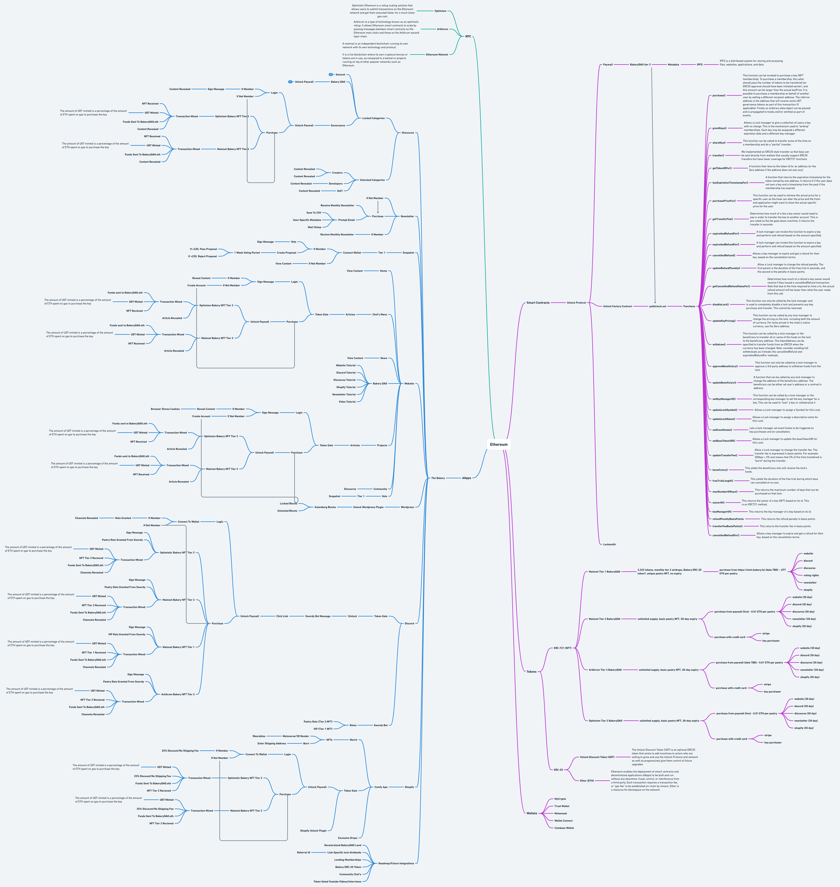

# SMART CONTRACTS

Underneath the surface, the [BakeryDAO](https://bakery.fyi) consists of more than six main contracts at this time. Some of them leverage [Unlock Protocol](https://unlock-protocol.com) for NFT memberships, some of them leverage [0xSplits](https://0xsplits.xyz) for on-chain revenue splitting, and some use subdomain DAO contracts created by [Sismo DAO](https://sismo.io).

[PublicLock.sol](publiclock.sol.md) - the Pastry NFTs, which we use for token-gating special research pages on the website, and more!

[Pastry.sol](pastry.sol.md) (coming soon) - VIP  members, unlimited time subscription to the BakeryDAO, limited supply (2,222)

**Then there are some miscellaneous contracts we use, that are equally exciting:**

****[SDaoRegistrar.sol](https://github.com/sismo-core/ens-sdao) (coming soon) - kick start your own ENS subdomain DAO with this awesome contract!

[KeyPurchaser.sol](https://github.com/unlock-protocol/unlock/blob/master/smart-contract-extensions/contracts/KeyPurchaserFactory.sol) - used to approve specific addresses to spend a certain amount of x token at x time, useful for credit card purchases, and recurring members.

[ERC721BalanceOfHook.sol](https://github.com/unlock-protocol/unlock/blob/master/smart-contracts/contracts/hooks/ERC721BalanceOfHook.sol) - can be used to determine whether or not an address should be deemed a member based on any custom ERC-721.

Now that we have a basic understanding of what we're dealing with, let's get our hands dirty in some of the important smart contracts that are listed here...


[erc721minter.sol.md](../../technical/smart-contracts/erc721minter.sol.md)



[publiclock.sol.md](publiclock.sol.md)



[pastry.sol.md](pastry.sol.md)



[sdaoregistrar.sol.md](sdaoregistrar.sol.md)



[erc721balanceofhook.sol.md](../../technical/smart-contracts/erc721balanceofhook.sol.md)



[keypurchaser.sol.md](../../technical/smart-contracts/keypurchaser.sol.md)

