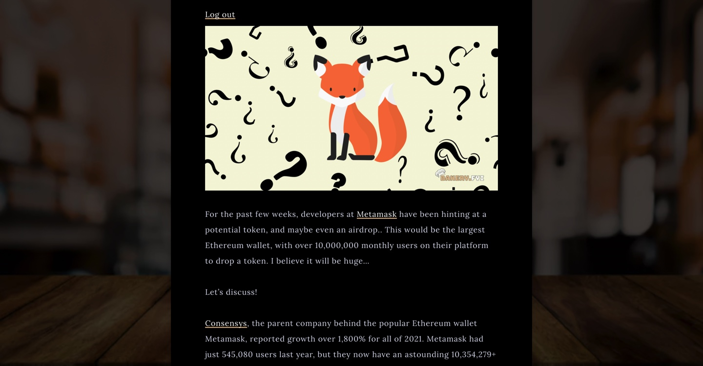
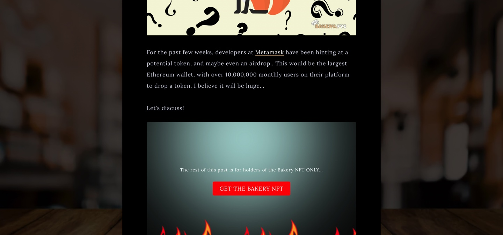

# 🔌 WP-Plugin

The plugin creates an Unlock block that can be used on WordPress posts and pages in the same manner as any other block. Creators can nest any "members-only" content they desire within the block.

Site visitors who have the appropriate "key" (in the form of Bakery NFTs) in their crypto wallet are granted immediate access to the content within the blocks on the website. Unauthenticated visitors, on the other hand, will see that there is content available, and will be prompted to become a member of the site in order to access that content!

**MEMBER POV:**

****

**NON-MEMBER POV:**

****

Using the plugin, chef's can build up memberships on the site, providing exclusive features and benefits, grant perks, or optionally monetize any content they wish using Ethereum, and many other supported ERC-20 assets.

For site visitors who are not yet onboarded into web3, the plugin also supports credit card transactions via Stripe integration.

You can view the [source code here](https://wordpress.org/plugins/unlock-protocol/).
