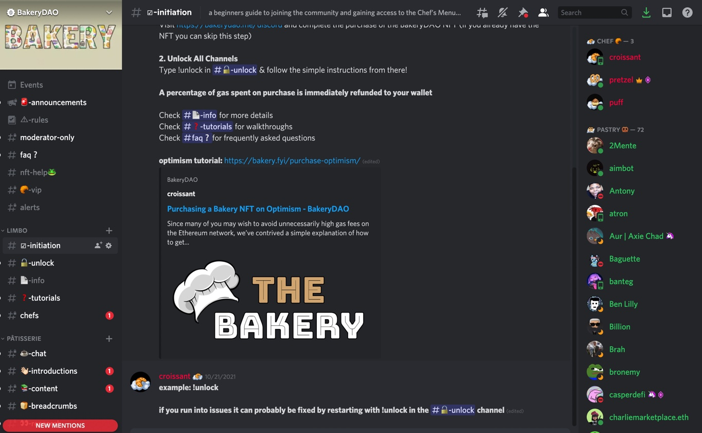

# 🤖 Discord

The [BakeryDAO Discord](https://discord.gg/bakerydao) is our most active community group. It's an app where we all meet to discuss things going on in DeFi, and only users with the appropriate BakeryNFTs are given the roles to see all channels.

All you have to do to get verified is connect your Ethereum wallet, and you will be synced with the proper roles! We use two bots to do this, follow either of these links below for a tutorial on how to do it on each:


[Broken link](broken-reference)



[guild-xyz.md](guild-xyz.md)


