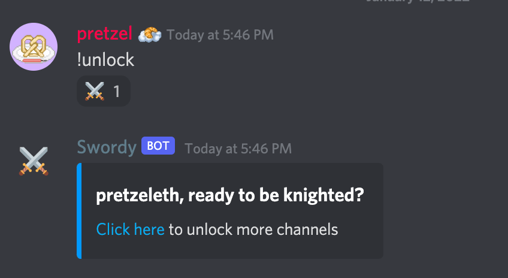
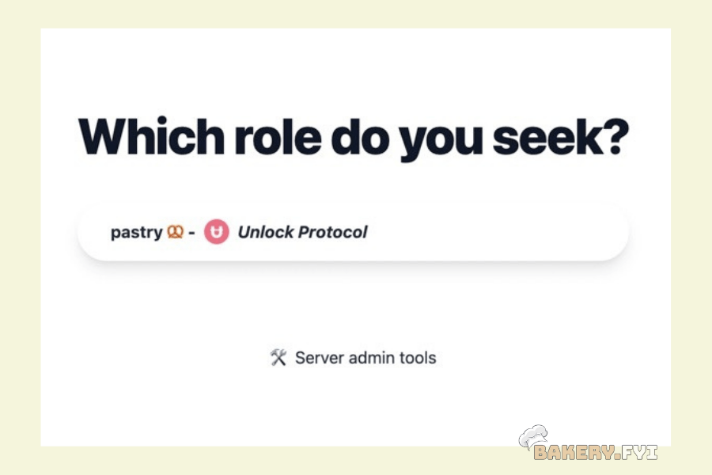
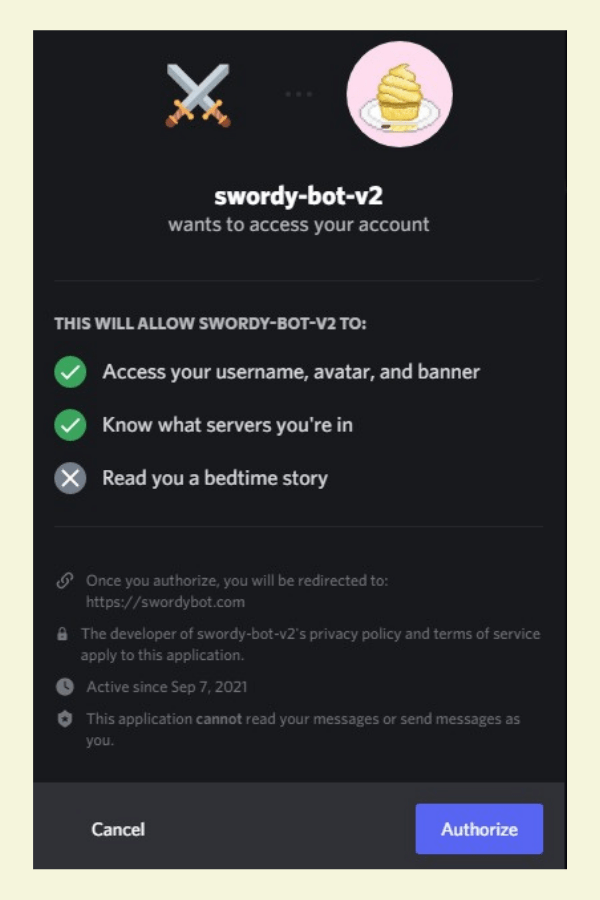

# ⚔ Swordy Bot



[Swordy Bot](https://swordybot.com), made by [Patrick Gallagher](https://github.com/pi0neerpat/unlock-protocol-bot/tree/e448d1f81a49c4b0b021d09bb623991ae87c55f5), made it extremely easy to integrate our Bakery NFTs with Discord, token-gating special channels and granting them a role in channels if they had a valid key. The magic all happens in this one line of code where it calls the `getHasValidKey` function on the appropriate contract.

```js
const hasValidKey = await lockContract.getHasValidKey(userAddress)
```

When users first visit the BakeryDAO Discord, they will see only a few channels with directions to go to the !unlock channel to type "!unlock" and continue with verification to confirm if they are already have a membership to the BakeryDAO, and if they aren't, they will be redirected to the paywall to complete purchase.


After this, follow the link given to you by Swordy Bot and select which role you'd like to select for the BakeryDAO.



Next, authorize Swordy Bot for him to confirm whether or not it should give you access to the content by redirecting you to the BakeryDAO paywall, thereby granting you a role in the server if applicable from there.&#x20;



**If you are a member (holder of the BakeryNFT), Swordy Bot will redirect you back to the Discord with a new role with all channels available!**

**If you aren’t a member, you will be redirected to the paywall where you can continue from there.**

**For BakeryNFT holders**, or 30 - day subscribers, the role "pastry 🥨" is token-gated, where they get access to 20+ channels in the Discord, where all of the other pastries in the community are.

**For BakeryDAO holders**, or lifetime members, the role "vip 🧁" is token-gated, where they get access to 22+ channels in the Discord.
