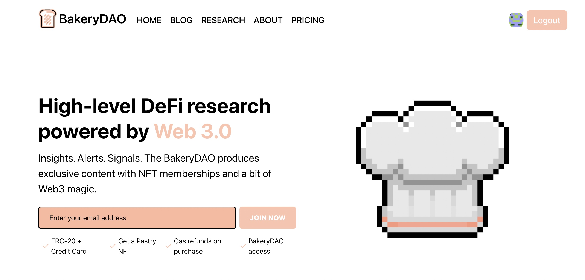

# 👉 pastry.xyz

This is where you get all the alpha. The pastries are cooking up all the breadcrumbs and research from the community and laying them out here on their relevant pages. The catch? In order to view some of this content, visitors of the website must be holder of the Bakery NFTs, otherwise they will be directed to a paywall to continue to view the content.

Visiting the [pastry.xyz](https://pastry.xyz) website, you'll see a navigation page with some categories of content to select from.

**Unlocked Categories:**

<mark style="color:orange;">News -</mark> where the latest reports in DeFi are coming out on a daily basis from the Chef's in the Bakery

<mark style="color:orange;"></mark>[<mark style="color:orange;">BakeryDAO</mark>](https://bakery.fyi/bakery-nft/) <mark style="color:orange;">-</mark> this is where all of the documentation and tutorials for the BakeryDAO NFTs will be posted (with many already there)

**Locked Categories:**

<mark style="color:orange;"></mark>[<mark style="color:orange;">Chef's Menu</mark>](https://bakery.fyi/the-menu/) <mark style="color:orange;">-</mark> where special content from each of the Chef's is posted, containing the hottest breadcrumbs for pastries (holders of any BakeryNFT)

<mark style="color:orange;"></mark>[<mark style="color:orange;">Projects</mark>](https://bakery.fyi/research/) <mark style="color:orange;">-</mark> have an itch to learn more about a particular token in DeFi? That's good news if you're a pastry, who has access to all these new reports on innovative tokens frequently!

**Other Navigation Areas (Token-Gated):**

<mark style="color:orange;"></mark>[<mark style="color:orange;">Community</mark>](https://bake.community) <mark style="color:orange;">-</mark> where all of the pastries gather to discuss various governance proposals, content ideas, and much more on Discourse...

<mark style="color:orange;">Vote -</mark> where holders of the BakeryDAO tokens (no expiry) can propose various proposals or vote with their tokens in an off-chain manner.

