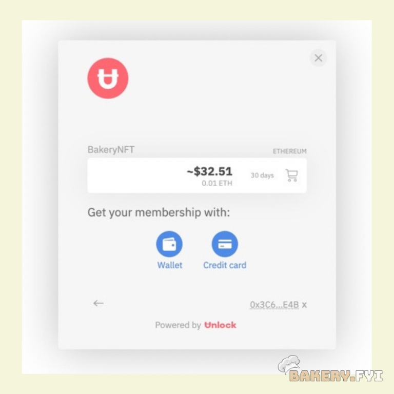

# 💻 Discord

Step 1. Head over to [The BakeryDAO Discord](https://discord.gg/bakerydao)

Step 2. Once you are in the #initiation channel, you will see a welcome message with two prompts.

 (2).png>)

Click on the link below “Acquiring the Bakery NFT”

After clicking, you will be redirected to a web page that looks like this:

.png>)

Step 3. Click on the “BakeryNFT” subscription. You will then be prompted to connect to your Ethereum wallet (compatible with Coinbase Wallet, Metamask, WalletConnect, and Trust Wallet), where you can then complete your purchase of the Bakery NFT.

Step 4. Once you’ve clicked the button above, follow through with the prompts in Metamask and complete the purchase of the NFT (This step will require a little bit of ETH).

Step 5. Once you’ve completed the purchase of the Bakery NFT, head back into the discord and open the #unlock channel

Step 6. In the #unlock channel, type “!unlock”.

 (1).png>)

Step 7. Click on the link Swordy responds to you with.

Step 8. Click “Authorize”

 (2).png>)

You will be directed to a webpage that looks like this:

 (2).png>)

If you own a Tier One Bakery NFT, click the “VIP” option. If you own a Tier Two, click the “Pastry” option (only tier 2’s are live at the moment).

After following these steps Swordy Bot will redirect you back to the Discord channel with your assigned roles and access to hidden channels. If you run in to any issues try starting over in Discord by typing “!unlock” again. Feel free to reach out to the admins for any help or troubleshooting!
