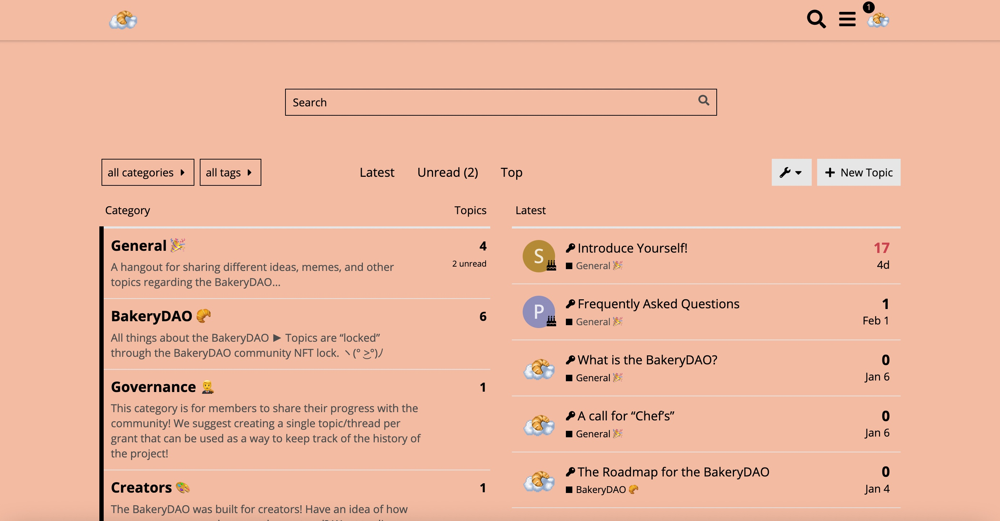
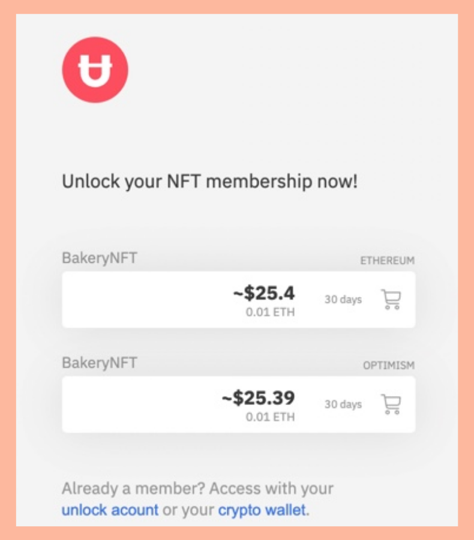
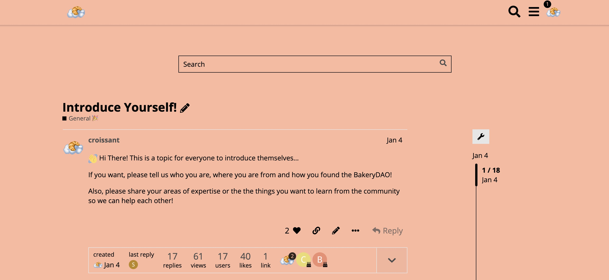

# 🎱 Discourse

Interested in viewing the latest topics in the BakeryDAO, and participating in governance proposals + discussions? You’re in the right place!

Start right away by visiting: [The Bake Community](https://bake.community) on Discourse. As a first time visitor, the page will look something like this:

In the top right corner, you’ll see options to login or sign up for the site to begin posting. Sign up here or login to your existing discourse account to continue.

Once logged in or signed up for your account on Discourse, navigate to one of the locked categories or topics. If you are already a holder of the BakeryNFT, content will immediately be available for viewing. However, if you are not a member the topics will be hidden behind the BakeryNFT.

It will look something like this:

From here, connect to you Ethereum wallet and continue with the purchase of the BakeryNFT in you wallet.

.png>)

Once connected, you’ll be able to complete the purchase by selecting “Wallet,” and confirming the prompt in your Ethereum wallet.

Congratulations! You are now a member of the BakeryDAO and can benefit from all of its features! Members will be granted full access to posting on the community-powered forum for the BakeryDAO. It will look something like this:

If you have any questions, feel free to ask the administrators on any of the platforms we are integrated with!
