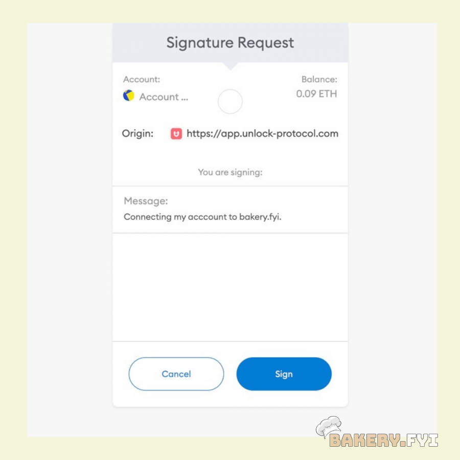

# 🔳 Logging-in

Until now, it was often quite complicated for applications (both web and native) to prompt the user for their wallet address, in order to identify them. As there exists many types of wallets (browser extensions, mobile applications, or even fully "hosted" web apps), it means that asking the user to connect their wallet requires the implementation of multiple API and approaches. Dealing with "injected" objects in the DOM is not trivial and limited to web applications…

The BakeryDAO is proud to be using an implementation of the [Sign-In With Ethereum](https://docs.unlock-protocol.com/unlock/developers/sign-in-with-ethereum) ([EIP4361](https://eips.ethereum.org/EIPS/eip-4361)) specification!

This is the flow that is implemented in the WordPress plugin for The Bakery website.

The flow to be similar to the frequently used **OAuth** & **OpenId Connect** flows, so that other applications who only need to _know_ of the user's address do not have to worry about handling web3 providers, but will still being able to identity users. For this, we make it trivial for applications to build "authentication" URLs with a **redirect scheme** that allows even native application to easily identify the user's address.
